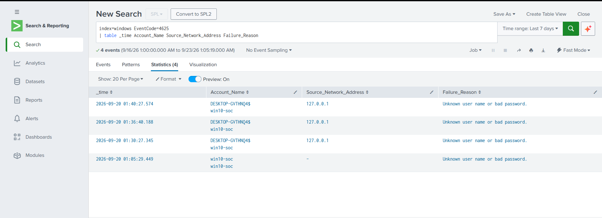
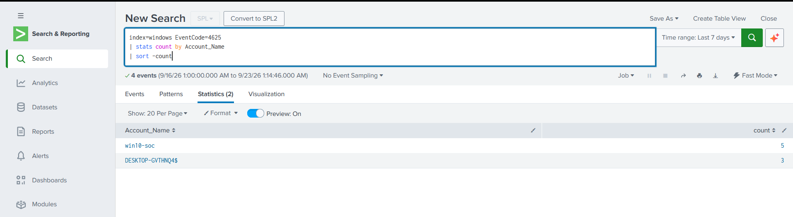
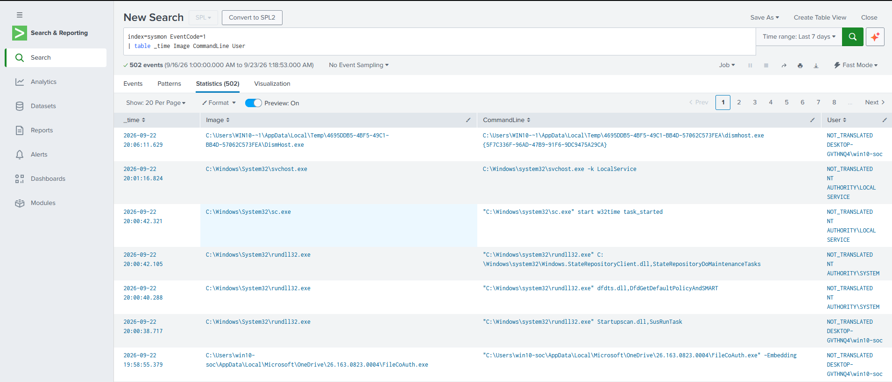

# Screenshots

This folder contains screenshots from my SOC lab investigations using Splunk.

## Splunk Evidence

---

## 1. Failed Login Detection

### Objective

Detect failed authentication attempts in Windows environment using Splunk.

### SPL Query

```spl
index=windows EventCode=4625
| table _time Account_Name Source_Network_Address Failure_Reason
```

### Screenshot




---

## 2. Top Failed Login Users

### Objective

Identify users with multiple failed login attempts and analyze authentication failure patterns.

### SPL Query

```spl
index=windows EventCode=4625
| stats count by Account_Name
| sort -count
```

### Screenshot




---

## 3. Sysmon Process Creation Monitoring

### Objective

Monitor process creation activity and identify suspicious execution behavior using Sysmon Event ID 1.

### SPL Query

```spl
index=sysmon EventCode=1
| table _time Image CommandLine User
```

### Screenshot




---

## Lab Environment

- Splunk Enterprise
- Windows Security Logs
- Sysmon
- Windows 10 SOC Lab
